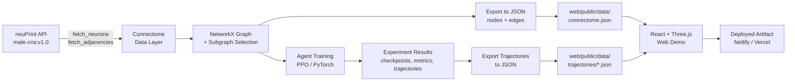
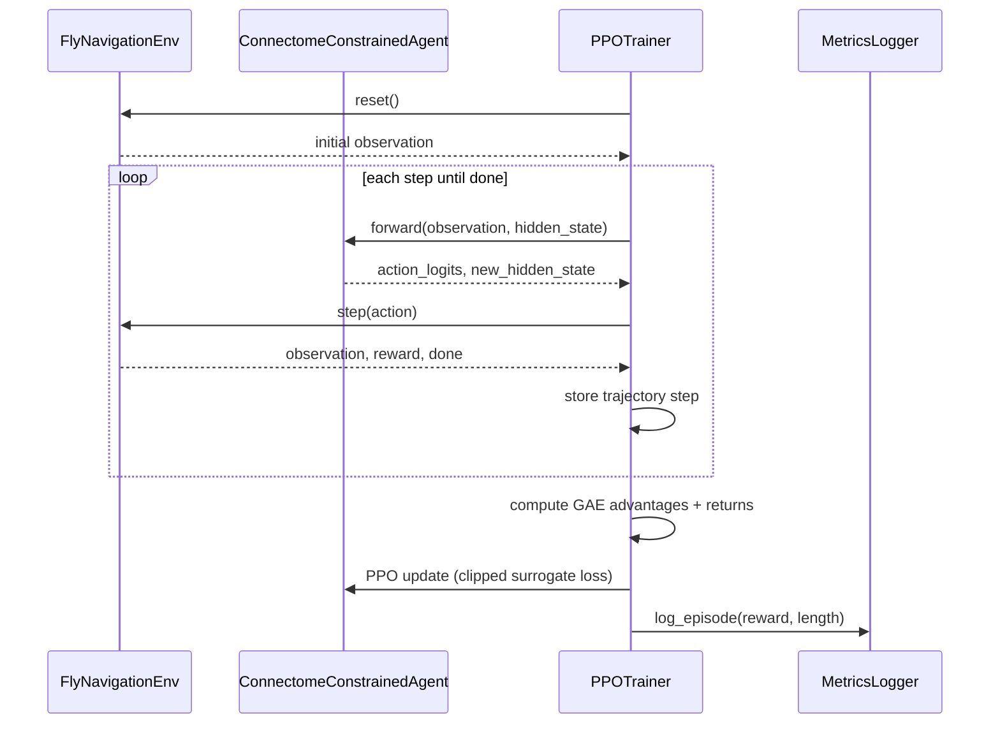
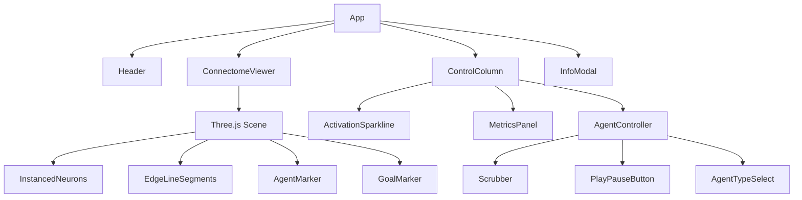
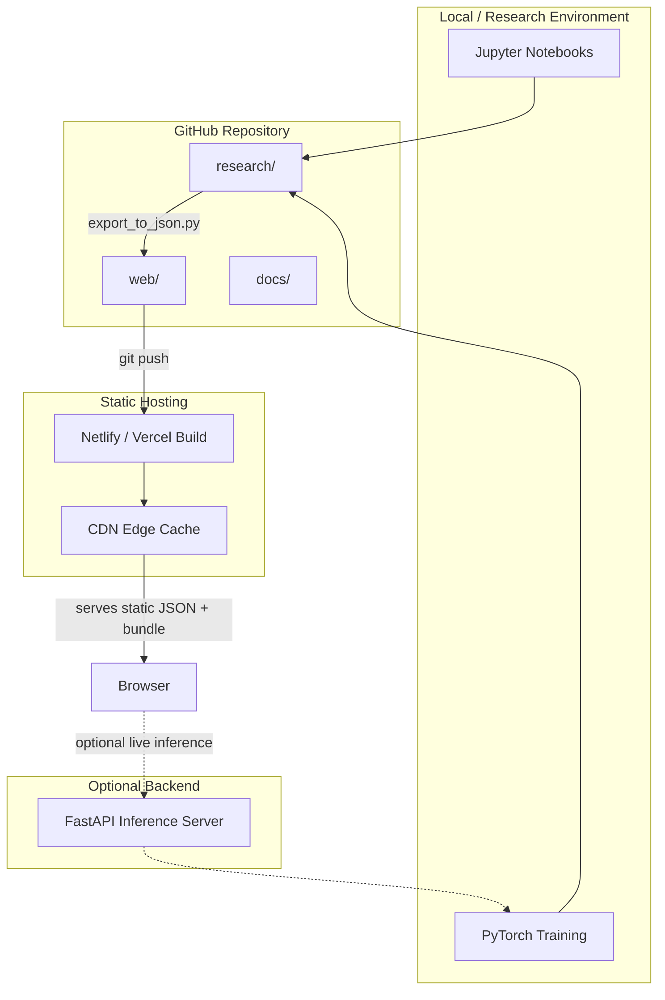

# Design Documentation: Connectome-Powered Navigation Agent

This document covers the complete design system for the web demo, plus architecture and data-flow diagrams for the whole project. Pair with `connectome-agent-project-guide.md` for implementation code.

---

## Table of Contents
1. [Design Principles](#design-principles)
2. [Visual Design System](#visual-design-system)
3. [Layout & Wireframes](#layout--wireframes)
4. [Component Design Specs](#component-design-specs)
5. [3D Scene Design](#3d-scene-design)
6. [Data Visualization Design](#data-visualization-design)
7. [User Flows](#user-flows)
8. [Responsive Design](#responsive-design)
9. [Accessibility](#accessibility)
10. [System Architecture Diagrams](#system-architecture-diagrams)
11. [Motion & Interaction Design](#motion--interaction-design)

---

## Design Principles

Since this is a science-communication tool as much as a portfolio piece, the design should follow four principles:

1. **Clarity over decoration** — every visual element (color, glow, motion) should encode a piece of data (activation state, agent type, reward). No ornamental effects.
2. **Dark-lab aesthetic** — dark background mimics a neuroscience lab / control-room feel, makes neon neuron colors pop, and is easy on the eyes for long viewing sessions (common in dev portfolios and data-viz tools like Observable).
3. **Progressive disclosure** — default view is simple (rotating connectome + play button); deeper data (per-neuron IDs, raw metrics) is revealed on hover/click, not dumped upfront.
4. **Legible at a glance, rich on inspection** — a recruiter scanning for 10 seconds should "get it" from the hero visual; a technical reviewer digging in should find full rigor.

---

## Visual Design System

### 2.1 Color Palette

| Token | Hex | Usage |
|---|---|---|
| `--bg-primary` | `#0D0D0F` | Main app background (near-black, not pure black — reduces OLED smearing) |
| `--bg-panel` | `#16161A` | Side panel / card backgrounds |
| `--bg-panel-raised` | `#1E1E24` | Hover states, raised cards |
| `--border-subtle` | `#2A2A32` | Panel borders, dividers |
| `--text-primary` | `#F2F2F5` | Headings, primary text |
| `--text-secondary` | `#9A9AA5` | Labels, captions, metadata |
| `--text-tertiary` | `#5C5C66` | Disabled states, placeholders |
| `--neuron-inactive` | `#2E7D5B` | Resting neuron (muted green) |
| `--neuron-active` | `#FF4D5E` | Firing neuron (warm red — pops against dark bg) |
| `--neuron-sensory` | `#4DA6FF` | Sensory input neurons (blue) |
| `--neuron-motor` | `#FFB84D` | Motor output neurons (amber) |
| `--edge-default` | `#3A3A42` | Synapse connections at rest (low opacity, 25%) |
| `--edge-active` | `#FF4D5E` | Signal propagation along active edge |
| `--accent-primary` | `#5B8CFF` | Primary buttons, active tab, links |
| `--accent-primary-hover` | `#7BA3FF` | Hover state |
| `--accent-success` | `#3DDC97` | Success states, positive reward |
| `--accent-warning` | `#FFC857` | Warnings, ablation-mode indicator |
| `--accent-danger` | `#FF5C5C` | Negative reward, errors |

**Rationale**: This is a deliberate 3-hue coding scheme (blue=sensory/UI, red=activation, amber=motor) so a viewer can learn the legend once and read every subsequent visual without a key.

**Chart series colors** (for the 4 experiment conditions, colorblind-safe, from Okabe-Ito):
```
Connectome-Constrained:  #5B8CFF (blue)
Baseline (Unconstrained): #F2A65A (orange)
Random Weights:           #9A9AA5 (grey)
Pruned 50%:                #3DDC97 (green)
```

### 2.2 Typography

| Role | Font | Weight | Size | Line-height |
|---|---|---|---|---|
| Page title (H1) | Inter | 700 | 28px | 1.2 |
| Section header (H2) | Inter | 600 | 20px | 1.3 |
| Panel title (H3) | Inter | 600 | 15px | 1.4 |
| Body text | Inter | 400 | 14px | 1.6 |
| Metadata / captions | Inter | 400 | 12px | 1.5 |
| Numeric metrics (rewards, steps) | JetBrains Mono | 500 | 14–18px | 1.4 |
| Code / neuron IDs | JetBrains Mono | 400 | 12px | 1.5 |

**Rationale**: Inter for UI text (excellent legibility at small sizes, free, wide language support). JetBrains Mono for anything numeric/scientific — monospace numerals prevent layout jitter as metrics update in real time, and it visually signals "this is data, not prose."

Both are loadable via Google Fonts:
```css
@import url('https://fonts.googleapis.com/css2?family=Inter:wght@400;500;600;700&family=JetBrains+Mono:wght@400;500&display=swap');
```

### 2.3 Spacing Scale

4px base unit, standard 8-point-ish scale:
```
--space-1: 4px   (tight icon gaps)
--space-2: 8px   (inline element gaps)
--space-3: 12px  (compact card padding)
--space-4: 16px  (standard card padding)
--space-5: 24px  (section gaps)
--space-6: 32px  (major layout gaps)
--space-8: 48px  (page margins on large screens)
```

### 2.4 Elevation / Depth

No heavy drop shadows (they read as "generic Bootstrap card" on dark backgrounds). Instead, depth is communicated via:
- Subtle 1px border (`--border-subtle`)
- Slight background lightening (`--bg-panel` → `--bg-panel-raised`)
- On hover only: a 0 0 0 1px accent-colored ring, not a shadow

```css
.card {
  background: var(--bg-panel);
  border: 1px solid var(--border-subtle);
  border-radius: 8px;
}
.card:hover {
  background: var(--bg-panel-raised);
  box-shadow: 0 0 0 1px var(--accent-primary);
}
```

### 2.5 Iconography

Use a single consistent icon set — **Lucide** (open-source, matches Inter's geometric style). Key icons needed:
- `play`, `pause`, `rotate-ccw` (reset) — agent controls
- `activity` — metrics panel
- `git-branch` — connectome/graph views
- `layers` — ROI/region selector
- `info` — methodology tooltip
- `github`, `external-link` — footer/header links

---

## Layout & Wireframes

### 3.1 Desktop Layout (≥1280px) — Main Demo Screen

```
┌──────────────────────────────────────────────────────────────────────────┐
│  ● Connectome Navigator          [Research] [Demo] [Docs]      ⚙ 🔗GitHub │ ← Header, 56px
├───────────────────────────────────────────────────┬────────────────────────┤
│                                                     │  AGENT CONTROLLER      │
│                                                     │  ┌──────────────────┐  │
│                                                     │  │ Agent: Connectome ▾│  │
│                                                     │  └──────────────────┘  │
│                                                     │  ▶ Play  ↻ Reset       │
│              [ 3D CONNECTOME VIEWER ]              │  ─────●───────────     │
│                                                     │  Step 142 / 200        │
│         (rotating graph, agent marker,             │  Reward: 67.4          │
│          active neurons pulsing red)               │                        │
│                                                     ├────────────────────────┤
│                                                     │  NEURON ACTIVATION     │
│                                                     │  ┌──────────────────┐  │
│    ○ ○ ○   legend: ● sensory ● active ● motor      │  │ ▂▅█▃▂▁▄█▅▂ sparkline│  │
│                                                     │  └──────────────────┘  │
│                                                     ├────────────────────────┤
│                                                     │  METRICS COMPARISON    │
│                                                     │  ┌──────────────────┐  │
│                                                     │  │   line chart      │  │
│                                                     │  │  (4 experiments)  │  │
│                                                     │  └──────────────────┘  │
│                                                     │  Table: reward/eff/... │
├─────────────────────────────────────────────────────┴────────────────────────┤
│  ⓘ Central Complex subgraph · 2,847 neurons · 15,234 synapses · male-cns:v1.0│ ← Footer strip, 32px
└──────────────────────────────────────────────────────────────────────────────┘
   ← 2fr (viewer) ────────────────────────→ ← 1fr (control column, ~380px) →
```

**Grid**: CSS Grid, `grid-template-columns: 1fr 380px`, full-height minus header/footer.

### 3.2 Mobile Layout (<768px) — Stacked

```
┌───────────────────────────┐
│ ● Connectome Nav      ☰   │ ← 48px header, hamburger for nav
├───────────────────────────┤
│                           │
│   [ 3D VIEWER ]           │ ← 45vh, touch-drag to rotate
│   (simplified — fewer     │
│    edges rendered for     │
│    perf on mobile GPUs)   │
│                           │
├───────────────────────────┤
│ ▶ Play    ↻ Reset         │
│ ●━━━━━━━━━━━━━━━━○        │ ← scrubber
│ Step 142/200 · R: 67.4    │
├───────────────────────────┤
│ [Activation] [Metrics] ▾  │ ← tabs, collapse to save space
│   (active tab content)    │
├───────────────────────────┤
│ ⓘ 2,847 neurons · CX      │
└───────────────────────────┘
```

**Key mobile adaptations**:
- Metrics/activation panels become swipeable tabs instead of stacked (avoids endless scroll)
- 3D viewer renders at reduced edge-opacity / uses instanced meshes to hit 30fps on mid-range phones
- Touch targets minimum 44×44px (Play/Reset buttons enlarged vs desktop)

### 3.3 Comparison View (Side-by-Side Agents)

Triggered from a "Compare" toggle in the Agent Controller.

```
┌──────────────────────────────┬──────────────────────────────┐
│   CONNECTOME AGENT            │   BASELINE AGENT              │
│   ┌────────────────────┐     │   ┌────────────────────┐     │
│   │  mini 3D viewport    │     │   │  mini 3D viewport    │     │
│   │  (synced playhead)   │     │   │  (synced playhead)   │     │
│   └────────────────────┘     │   └────────────────────┘     │
│   Reward: 95.2   Steps: 118   │   Reward: 88.9   Steps: 156   │
│   Efficiency: 0.81             │   Efficiency: 0.68             │
└──────────────────────────────┴──────────────────────────────┘
│         ▶ Play Both   ●━━━━━━━━━━━━━━━━━━○  synced scrubber   │
└─────────────────────────────────────────────────────────────┘
```

Both mini-viewports share one timeline scrubber (single source of truth for step index) — this is the single most persuasive visual in the whole project: same start/goal, visibly different paths.

---

## Component Design Specs

### 4.1 Header
- Height: 56px, `--bg-panel` background, `1px solid --border-subtle` bottom border
- Left: dot-logo (12px circle, `--accent-primary`, pulses subtly via CSS `@keyframes pulse`) + wordmark
- Center-right: nav pills (Research / Demo / Docs) — active pill gets `--bg-panel-raised` background, rounded-full
- Right: settings gear (opens ROI/region selector modal) + GitHub icon button (links to repo)

### 4.2 Agent Controller Card
- Fixed 380px width on desktop, full width on mobile
- Dropdown selector uses native `<select>` styled with custom chevron (Lucide `chevron-down`), not a fake custom dropdown — keeps it keyboard accessible for free
- Play button: pill-shaped, `--accent-primary` fill, white icon+label, 40px height
- Reset button: ghost style (transparent bg, `--border-subtle` border), sits beside Play
- Scrubber: custom-styled `<input type="range">` — track is `--border-subtle`, filled portion (played so far) is `--accent-primary`, thumb is a 12px circle with `--accent-primary` fill + white ring on focus
- Step/Reward readout: monospace font, right-aligned, updates every animation frame without layout shift (fixed-width via `tabular-nums`)

### 4.3 Neuron Activation Sparkline
- Compact inline sparkline (not a full chart) showing aggregate activation over the last 30 steps
- Rendered with lightweight inline SVG (`<polyline>`), 240×48px
- Color: `--neuron-active` line on transparent background, subtle area-fill at 15% opacity beneath the line

### 4.4 Metrics Comparison Chart
- Recharts `LineChart`, 4 series (one per experiment condition), colors per §2.1 chart palette
- Legend: horizontal, below chart, uses colored dot + label (not colored text — better for colorblind users)
- Tooltip: dark card (`--bg-panel-raised`), shows exact episode + reward value in monospace
- X-axis: "Episode" — gridlines every 500 episodes, label rotated 0° (kept horizontal by thinning tick density, not rotating text)
- Y-axis: "Cumulative Reward" — starts at 0 unless negative rewards occur

### 4.5 Info / Methodology Panel (Modal)
Triggered by the `ⓘ` footer strip or header settings icon.
- Modal overlay: `rgba(13,13,15,0.7)` backdrop blur(4px)
- Modal card: max-width 560px, centered, `--bg-panel` background, `--space-5` padding, 12px border-radius
- Content: dataset version, ROI name + neuron/synapse count, link to METHODOLOGY.md, link to neuPrint source
- Close: `×` top-right, also closable via `Esc` and backdrop click

---

## 3D Scene Design

This is the centerpiece visual — worth specifying precisely rather than leaving to whatever Three.js defaults produce.

### 5.1 Camera
- `PerspectiveCamera`, FOV 55° (narrower than the 75° in the starter code — 75° causes excessive fisheye distortion on a dense point cloud; 50–55° reads as more "scientific instrument," less "video game")
- Default distance: framed so the full subgraph bounding sphere fills ~70% of viewport height
- Auto-rotate: slow, `0.05 rad/s` around Y-axis only, pauses on user drag (`OrbitControls` with `autoRotate` + `enableDamping: true`, `dampingFactor: 0.08` for a smooth "sci-fi console" drag feel)

### 5.2 Lighting
- `AmbientLight` at low intensity (0.4) — prevents pure-black shadow sides on spheres
- Single `PointLight` co-located with camera (headlight rig) — ensures neurons are always lit regardless of rotation, avoids needing multiple lights
- No shadows (`castShadow: false` everywhere) — with 2,800 spheres, shadow maps are a real performance cost for near-zero visual benefit at this node density

### 5.3 Neuron (Node) Rendering
- Geometry: `IcosahedronGeometry(radius, 1)` instead of `SphereGeometry` — slightly faceted look reads as more "technical/schematic" than a smooth sphere, and is cheaper to render at scale
- **Critical performance note**: at 2,800+ nodes, do NOT create 2,800 individual `Mesh` objects (as in the starter code) — use `InstancedMesh` with per-instance color via `InstancedBufferAttribute`. This is the single biggest performance fix needed before shipping the web demo.
- Size: base radius 1.2 units, scaled up 1.6× for the top-20 hub neurons (by centrality) so the graph has visual "landmarks" even before interaction
- Color by state (see palette): grey/green resting → red pulse on activation, blue for sensory-layer nodes, amber for motor-layer nodes (color takes priority: sensory/motor identity shown at rest, overridden by red pulse only during that node's active frame)

### 5.4 Edges (Synapses)
- `LineSegments` with a single shared `BufferGeometry` (as in starter code — this part was already correct)
- Default opacity 0.12 (very faint — 15k edges at full opacity is visual noise)
- **Active-path highlighting**: when the agent's hidden-state activation crosses a node, the edges immediately downstream of it flash to `--edge-active` at 0.8 opacity for ~150ms, then fade back to 0.12 over 400ms (implemented as a small opacity-decay buffer per edge, updated each frame — not a full re-render of the LineSegments geometry)
- Edge width is not controllable per-segment in vanilla `LineBasicMaterial` (WebGL limitation) — represent synapse strength via opacity, not thickness, to avoid needing `Line2`/fat-lines complexity

### 5.5 Agent Marker
- A distinct glowing icosahedron (larger, radius 3, emissive material) travels along the trajectory path
- Trail: last 20 positions rendered as a fading polyline (opacity decays linearly from 0.6 to 0 along the trail) — gives a sense of momentum/direction
- Goal marker: a static wireframe octahedron at the goal position, slowly rotating independently, colored `--accent-success`

### 5.6 Background
- Solid `--bg-primary` (#0D0D0F), not pure black — matches the rest of the UI so the 3D canvas doesn't look like a "different app" embedded in the page
- Optional (nice-to-have, not required): extremely sparse starfield particle system (200 static points, low opacity) for depth cues — skip if it distracts from the connectome itself

---

## Data Visualization Design

### 6.1 Chart Type Decisions

| Data | Chart type | Why |
|---|---|---|
| Learning curves (4 experiments over episodes) | Multi-line chart, 50-ep moving average | Standard for RL learning curves; moving-average smooths noise without hiding trend |
| Final metrics comparison (reward/efficiency/speed) | Grouped bar chart | Easier to compare discrete final values across 4 conditions than reading off line-chart endpoints |
| Neuron activation frequency | Horizontal bar (top 20 neurons) | Ranking task — horizontal bars let long neuron-ID labels stay readable |
| Path trajectories | 3D line plot (in the connectome viewer itself, not a separate chart) | Spatial data belongs in the spatial view |
| Ablation summary table | Plain data table, monospace numerals | When precision matters more than pattern-spotting, a table beats a chart |

### 6.2 Chart Styling Rules
- No 3D bar/pie charts, ever (distorts value perception)
- No dual y-axes on the same chart (a classic way to mislead — keep reward and efficiency on separate charts)
- Gridlines: `--border-subtle`, dashed, low opacity — present but not competing with data
- Always label axes with units (`Episode`, `Cumulative Reward`) — a chart with unlabeled axes is a common portfolio-review red flag

---

## User Flows

### 7.1 First-Time Visitor Flow
```
Land on page
   → 3D connectome already rotating (no click needed to see something alive)
   → Agent auto-plays a short demo loop (best episode, connectome agent) after 1.5s
   → User watches, sees reward counter climb
   → Notices dropdown → switches to "Baseline" → sees visibly less direct path
   → Clicks ⓘ → reads 2-sentence methodology summary → clicks through to GitHub/docs for depth
```
Design implication: **nothing should require a click to be legible.** The default state on load must already demonstrate the core finding.

### 7.2 Technical Reviewer Flow
```
Land on page → skip demo → click "Compare" → watches synced dual playback
   → opens Metrics Comparison → hovers chart to inspect specific episodes
   → clicks GitHub icon → lands on README → clicks docs/METHODOLOGY.md
   → clones repo → runs notebooks locally
```
Design implication: every visual claim needs a one-click path to the underlying notebook/data — no dead-end visuals.

### 7.3 Recruiter (10-Second) Flow
```
Land on page → sees rotating 3D brain graph with glowing agent + climbing reward number
   → reads one-line header tagline → clicks GitHub → skims README results table → leaves impressed or messages you
```
Design implication: the header tagline (currently a placeholder — see §8) carries a lot of weight; keep it to one plain-English sentence, no jargon.

**Header tagline recommendation**: *"Training AI agents on the actual wiring of a fruit fly's brain."*

---

## Responsive Design

| Breakpoint | Range | Layout behavior |
|---|---|---|
| `mobile` | < 768px | Single column, tabs for side panels, 45vh 3D viewport, enlarged touch targets |
| `tablet` | 768–1279px | Two-column but narrower control panel (320px), font sizes step down one notch |
| `desktop` | ≥ 1280px | Full layout as in §3.1 |
| `wide` | ≥ 1600px | Control panel widens to 440px, max content width capped at 1800px (centered) to avoid absurd line lengths on ultrawide monitors |

Implementation: CSS Grid with `grid-template-columns` swapped via media queries; avoid JS-based responsive logic where CSS suffices (fewer reflow bugs, works before JS hydrates).

---

## Accessibility

- **Color is never the only signal**: activation state also changes size (active neurons scale 1.3×) so colorblind users get a redundant cue; chart legends use shape/position + color, not color alone
- **Keyboard navigation**: Play/Pause/Reset are real `<button>` elements (not `<div onClick>`), scrubber is a real `<input type="range">` — both fully keyboard-operable and screen-reader-labeled via `aria-label`
- **Reduced motion**: respect `prefers-reduced-motion` — disable camera auto-rotate and edge-pulse animation, replace with a static "last active" highlight instead
- **Contrast**: `--text-primary` (#F2F2F5) on `--bg-primary` (#0D0D0F) = ~17.9:1 contrast ratio (exceeds WCAG AAA 7:1); `--text-secondary` on panel bg checked to stay above 4.5:1 (AA) for body text
- **Focus states**: every interactive element gets a visible `2px solid --accent-primary` outline on `:focus-visible` (not `:focus`, to avoid mouse-click outline noise)

---

## System Architecture Diagrams

### 8.1 High-Level Data Flow



### 8.2 Agent Training Sequence



### 8.3 Component Hierarchy (Web)



### 8.4 Deployment Topology



---

## Motion & Interaction Design

| Interaction | Animation | Duration | Easing |
|---|---|---|---|
| Neuron activation pulse | Scale 1.0→1.3→1.0, color fade to red and back | 300ms | `ease-out` in, `ease-in` out |
| Edge activation flash | Opacity 0.12→0.8→0.12 | 550ms total | linear decay |
| Camera auto-rotate | Continuous Y-rotation | 0.05 rad/s | linear (no easing — constant velocity reads as more "stable instrument") |
| Panel hover | Background + border color shift | 150ms | `ease` |
| Modal open/close | Opacity + scale 0.96→1.0 | 200ms | `ease-out` |
| Scrubber drag | Immediate (no animation lag on the thumb itself) | — | — |
| Tab switch (mobile) | Slide + fade cross-fade | 200ms | `ease-in-out` |

**Principle**: UI chrome animations stay under 250ms (feel instant, not sluggish). The one deliberately slow motion is camera auto-rotate — its slowness is what makes the connectome read as a real 3D object rather than a busy 2D scribble.

---

## Design Handoff Checklist

- [ ] Color tokens implemented as CSS custom properties in `web/src/index.css`
- [ ] Inter + JetBrains Mono loaded via Google Fonts `<link>` or self-hosted for offline dev
- [ ] `InstancedMesh` used for neuron rendering (not per-node `Mesh` — see §5.3 perf note)
- [ ] `prefers-reduced-motion` media query implemented
- [ ] All interactive elements keyboard-reachable and screen-reader labeled
- [ ] Mermaid diagrams in this doc render correctly on GitHub (verify after push — GitHub renders ```mermaid fences natively)
- [ ] Mobile layout tested on an actual mid-range device, not just Chrome DevTools emulation (WebGL perf differs meaningfully)
