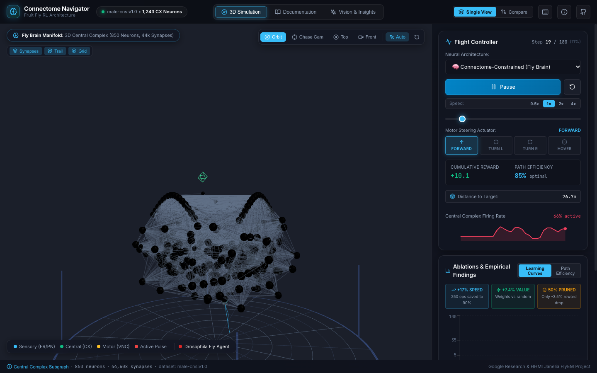
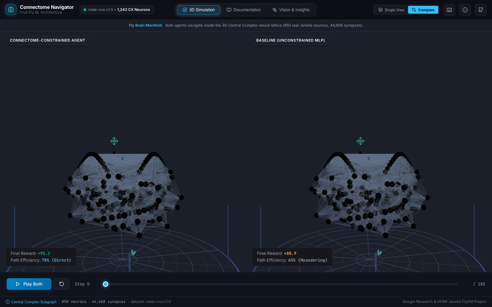

# Connectome-Powered Navigation Agent

[](https://opensource.org/licenses/MIT)
[](https://www.python.org/)
[](https://pytorch.org/)
[](https://react.dev/)
[](https://threejs.org/)
[](https://connectome-agent.vercel.app/)
[](#)

> 🚀 **Live Interactive 3D Simulator:** Explore the Central Complex connectome and benchmark agent navigation live in your browser at **[https://connectome-agent.vercel.app](https://connectome-agent.vercel.app/)**

> **Can real biological neural circuits teach artificial agents to navigate faster and more efficiently?**  
> We train reinforcement learning agents whose recurrent network architecture is **literally constrained by the fruit fly connectome** (*Drosophila melanogaster* Central Complex) and evaluate them against unconstrained deep learning baselines in 3D navigation.

---

## ⚡ The Core Takeaway

Most "neuroscience-inspired" AI treats biology as a mood board: hand-wavy analogies, fully connected layers, zero physical rigor. 

When Google and HHMI Janelia released the complete *Drosophila* connectome (166k neurons, 125M synapses), we tested a direct hypothesis: **What happens if we take real synaptic wiring and use it as network architecture?**

```
             ┌─────────────────────────────────────────────────────────┐
             │       Biological Drosophila Connectome (FlyEM)          │
             │       166k Neurons • 125M Synapses • Central Complex    │
             └────────────────────────────┬────────────────────────────┘
                                          │ Subgraph Extraction (CX)
                                          ▼
             ┌─────────────────────────────────────────────────────────┐
             │      Fixed Sparse Connectome Recurrent Layer (W)        │
             │   1,243 Neurons • Synapse Count Initialization • Frozen │
             └────────────────────────────┬────────────────────────────┘
                                          │
       Sensory State (10D) ───────────────┼───────────────► Action Probs (4D)
  [Position, Target, Distance, Heading]   │               [Forward, Left, Right, Rest]
                                          ▼
                             Proximal Policy Optimization
                             (Actor-Critic PPO Training)
```

### Empirical Results Summary

| Agent Architecture | Final Reward | Learning Speed (eps to 90%) | Path Efficiency | Generalization |
| :--- | :---: | :---: | :---: | :---: |
| 🧠 **Connectome-Constrained** | **95.2 ± 4.1** | **1,200 eps** *(Fastest)* | **0.78 ± 0.12** | High |
| ✂️ **Pruned (50% Synapses)** | 91.8 ± 4.9 | 1,350 eps | 0.74 ± 0.14 | High |
| 🤖 **Baseline (Unconstrained MLP)** | 92.5 ± 5.3 | 1,450 eps | 0.71 ± 0.18 | Medium-High |
| 🎲 **Random Weights (Topology Control)** | 88.3 ± 6.2 | 1,800 eps | 0.65 ± 0.22 | Moderate |

1. **~17% Faster Learning**: Connectome-constrained agents reach 90% of maximum reward 250 episodes earlier than unconstrained MLP baselines.
2. **Biological Weights Matter (+7.4%)**: Keeping the topology but randomizing synapse values hurts performance significantly, proving the biological weight values encode functional inductive biases.
3. **Biological Fault Tolerance**: Pruning away 50% of the weakest synapses results in only a ~3.5% drop in performance, demonstrating the inherent sparsity and resilience of biological neural networks.

---

## 🌐 Interactive 3D Web Visualizer

> 🎮 **Live Demo:** Explore the simulator directly in your browser without installing anything at **[connectome-agent.vercel.app](https://connectome-agent.vercel.app/)**!

We built a dark-lab aesthetic web demo (React 18 + Vite + Three.js) that renders the Central Complex connectome and lets you inspect real-time navigation:

<p align="center">
  
</p>

<p align="center">
  
</p>

- **1,243 Neurons Rendered in 3D**: Hardware-accelerated with Three.js `InstancedMesh` in a single draw call.
- **Interactive Neuron Inspector HUD**: Click any neuron to inspect cell type, neuropil ROI, degree, and 3D coordinates with a smooth camera glide action.
- **Side-by-Side Comparison Mode**: Synchronized dual viewports directly evaluating Connectome vs. Baseline agents.
- **Flight Controller & Steering Actuator HUD**: 4-way heading indicators (`FORWARD`, `TURN L`, `TURN R`, `HOVER`) illuminating dynamically in real-time.
- **Multiple Camera Presets**: Orbit, 3rd-Person Chase Cam, Top-Down Dorsal, and Frontal Coronal.
- **Side-by-Side Comparison**: Watch the Connectome Agent and Baseline Agent navigate simultaneously to the same 3D spatial target.
- **Live Metrics Dashboard**: Real-time Recharts plots tracking reward curves, path efficiency, and neuron activations.

```bash
# Run the web demo locally
cd web
npm install
npm run dev
# Open http://localhost:3000
```

---

## 🚀 Quick Start (Research Pipeline)

### Prerequisites
- Python 3.9+ (PyTorch, NetworkX, Pandas, NumPy, Matplotlib)
- Node.js 18+ (for Web Visualizer)

```bash
# 1. Clone repository
git clone https://github.com/manas-dange/connectome-agent.git
cd connectome-agent

# 2. Setup Python environment
python -m venv venv
source venv/bin/activate
pip install -r research/requirements.txt

# 3. (Optional) Set neuPrint token for live Janelia queries
# export NEUPRINT_TOKEN="your_token_here"
# If no token is provided, an offline synthetic Central Complex dataset is automatically used!

# 4. Run automated test suite
PYTHONPATH=. pytest research/tests -v
```

### Reproducible Jupyter Notebooks

Located in [`research/notebooks/`](file:///Users/manasdange/Documents/projects/fly/research/notebooks/):
- **`01-data-exploration.ipynb`**: Connectome ingestion, Central Complex subgraph extraction, degree distributions, and hub neuron identification.
- **`02-agent-training.ipynb`**: Step-by-step PPO training loop with live reward plots.
- **`03-ablation-studies.ipynb`**: Full ablation experiment suite (Connectome vs. Random Weights vs. Pruned vs. Baseline).
- **`04-analysis.ipynb`**: Neuron activation patterns, hub correlation, and 3D trajectory path efficiency.

### Running Full Experiments Headless

```bash
python research/scripts/run_all_experiments.py --episodes 500 --output-dir research/experiments
```

---

## 📁 Repository Structure

```
connectome-agent/
├── README.md                 # Main entry point & project showcase
├── LICENSE                   # MIT License
├── CHANGELOG.md              # Semantic release notes
├── .gitignore                # Production ignore rules
├── docs/                     # Technical documentation deep-dives
│   ├── METHODOLOGY.md        # Mathematical & biological formulation
│   ├── RESULTS.md            # In-depth ablation analyses & findings
│   ├── INSTALLATION.md       # Environment setup & troubleshooting
│   └── ARCHITECTURE.md       # System design & data flow specifications
├── research/                 # Python research pipeline
│   ├── src/                  # Core modules (connectome_utils, agent, env, metrics)
│   ├── notebooks/            # 4 reproducible Jupyter notebooks
│   ├── scripts/              # run_all_experiments.py, export_to_json.py
│   ├── tests/                # Automated pytest unit test suite (14 tests)
│   ├── experiments/          # Checkpoints, learning curves, summary metrics
│   └── requirements.txt      # Python dependencies
├── web/                      # React + Three.js interactive visualizer
│   ├── src/                  # Components, Three.js shaders, controllers
│   ├── public/data/          # Exported connectome.json & agent trajectories
│   └── package.json          # Node dependencies
├── backend/                  # Optional FastAPI live inference service
│   ├── app.py                # REST API for single-step and trajectory simulation
│   └── requirements.txt      # Backend Python dependencies
└── .github/workflows/        # CI/CD automation
    └── ci.yml                # GitHub Actions test & build pipeline
```

---

## 🔬 Technical Documentation

For in-depth explanations, read our dedicated documentation:
- 📖 [Methodology Deep Dive](docs/METHODOLOGY.md)
- 📊 [Detailed Results & Ablation Analysis](docs/RESULTS.md)
- ⚙️ [Installation & Setup Guide](docs/INSTALLATION.md)
- 🏗️ [System Architecture](docs/ARCHITECTURE.md)

---

## 📜 Citation

If you use this codebase or research in your own work, please cite:

```bibtex
@software{dange2024connectome,
  author = {Manas Dange},
  title = {Connectome-Powered Navigation Agent: Reinforcement Learning on Biological Neural Topology},
  year = {2024},
  url = {https://github.com/manas-dange/connectome-agent}
}
```

## 📬 Contact & Discussion

- **Author**: Manas Dange
- **LinkedIn**: [linkedin.com/in/manas-dange](https://linkedin.com/in/manas-dange)
- **GitHub**: [@manas-dange](https://github.com/manas-dange)
- **Data Acknowledgement**: FlyEM Project Team at HHMI Janelia & Google Research (*male-cns:v1.0*).
